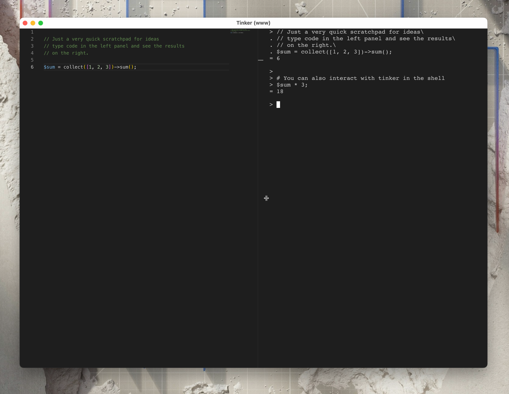

# Tinker GUI

[Latest Relase →](https://github.com/glhd/tinker-gui/releases/latest)

## Release workflow

- Tag a new version in git that starts with `v`
- Push to github
- Wait for actions to finish
- Draft release should be waiting
